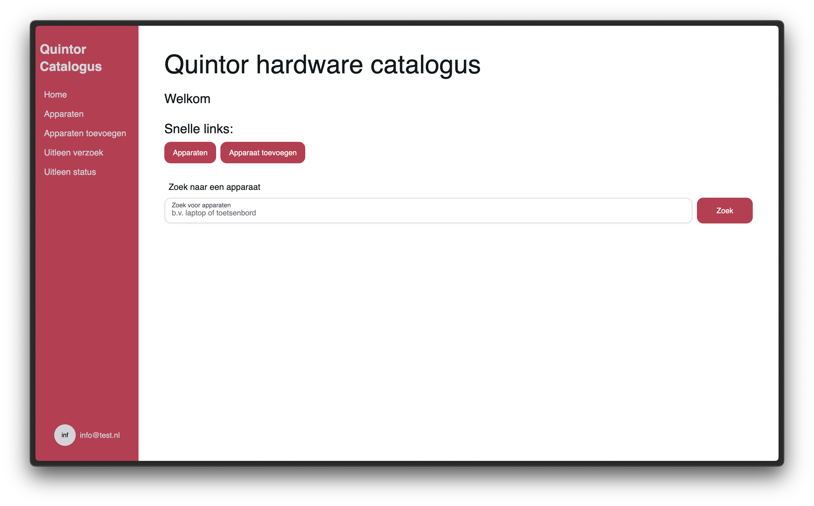
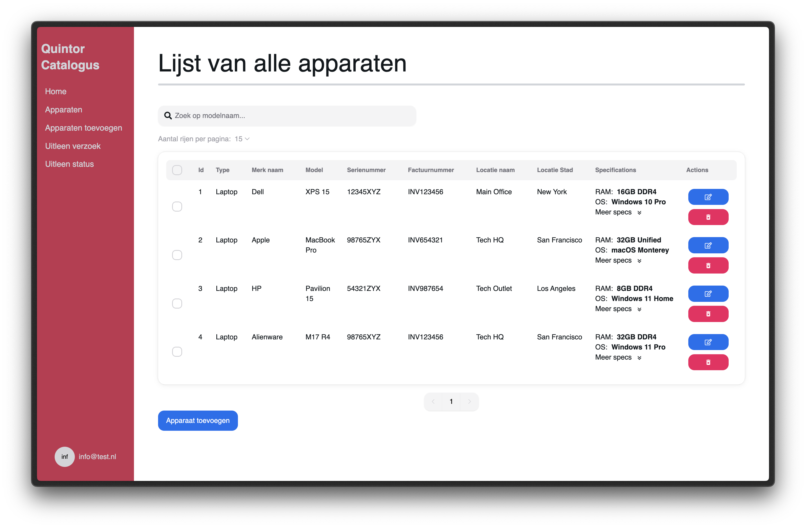
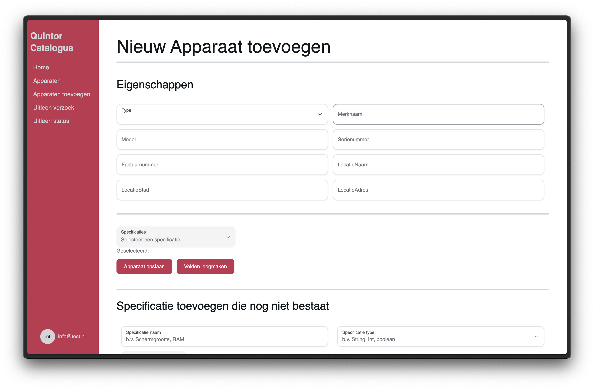
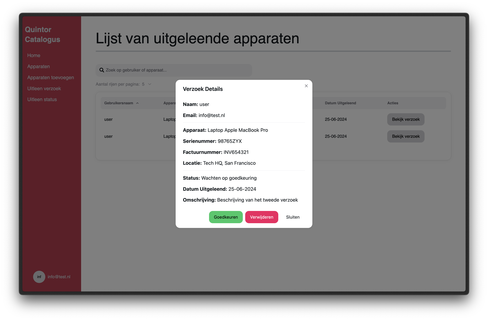

[![Contributors][contributors-shield]][contributors-url]
[![Stargazers][stars-shield]][stars-url]
[![Issues][issues-shield]][issues-url]
[![Forks][forks-shield]][forks-url]
[![LinkedIn][linkedin-shield]][linkedin-url]

# QuintorCatalogFrontEnd

The Quintor Catalog is an automated hardware catalog for the software company Quintor. System administrators can add, update, delete, search, filter, sort, and borrow hardware components.
CTO can approve/deny a borrow request to a user. The hardware is stored in a database. The back end was built using Spring Boot. [Go to Back end repo](https://github.com/MarkStreek/QuintorCatalogBackEnd)

As the name suggests, this is the front end of the project. The front end was built using React. The front end communicates with the back end using REST API.
If you're interested in the back end mechanisms, please take a look at the broad documentation in the back end repository.

[//]: # (
)

[//]: # (  <a href="https://github.com/MarkStreek/QuintorCatalogFrontEnd">)

[//]: # (    )

[//]: # (  </a>)

[//]: # (  <a href="https://github.com/MarkStreek/QuintorCatalogFrontEnd">)

[//]: # (    )

[//]: # (  </a>)

[//]: # (<h1 align="center">QuintorCatalogFrontEnd</h3>)

[//]: # ()
[//]: # (  
)

[//]: # (    Automated hardware catalog for the software company Quintor)

[//]: # (     )

[//]: # (    <a href="https://github.com/github_username/repo_name"><strong>Explore the docs »</strong></a>)

[//]: # (     )

[//]: # (     )

[//]: # (    <a href="https://github.com/github_username/repo_name">View Demo</a>)

[//]: # (    ·)

[//]: # (    <a href="https://github.com/github_username/repo_name/issues">Report Bug</a>)

[//]: # (    ·)

[//]: # (    <a href="https://github.com/github_username/repo_name/issues">Request Feature</a>)

[//]: # (  
)

[//]: # (
)

## Table of Contents

- [Table of Contents](#table-of-contents)
- [About Quintor](#about-quintor)
- [About the project](#about-the-project)
- [Built with](#built-with)
- [Getting Started](#getting-started)

## Getting Started

To start this project

## Known Issues

1. Double-click on dropdowns will cause an error, easy fixable by just realoading the page (F5/cmd + R)
2. If token is expired, in not all situations the user will be redirected to the login page, but don't worry, press the logout button and login again.
    - If this error occurs, the user can navigate through the application, but in absolutely no case can see information about devices or borrow requests.
3. POP-UP windows should be allowed by your browser. These alerts needs to be allowed because of certain actions in the application
    - It's not actually a bug or issue, but important to know, otherwise some actions could not work

## About Quintor

Quintor is a software company based in the Netherlands. Quintor helps customers to professionalize software development.

Quintor has the following disciplines:

1. Agile analytics
2. Software Development
3. Platform Engineering
4. Architecture
5. Cloud-native development
6. Security

## About the project

This project was created by students bioinformatics at the Hanze University of applied sciences. The main task was to create a (automated) catalog to store all hardware components in the company.

The hardware tools are stored in a database. This information is served to the front end using a REST API.

## Built with

<!-- Markdown Links -->
[contributors-shield]: https://img.shields.io/github/contributors/MarkStreek/QuintorCatalogFrontEnd.svg?style=for-the-badge
[contributors-url]: https://github.com/MarkStreek/QuintorCatalogFrontEnd/graphs/contributors
[stars-shield]: https://img.shields.io/github/stars/MarkStreek/QuintorCatalogFrontEnd.svg?style=for-the-badge
[stars-url]: https://github.com/MarkStreek/QuintorCatalogFrontEnd/stargazers
[issues-shield]: https://img.shields.io/github/issues/MarkStreek/QuintorCatalogFrontEnd.svg?style=for-the-badge
[issues-url]: https://github.com/MarkStreek/QuintorCatalogFrontEnd/issues
[linkedin-shield]: https://img.shields.io/badge/-LinkedIn-black.svg?style=for-the-badge&logo=linkedin&colorB=555
[linkedin-url]: https://www.linkedin.com/company/quintor/
[forks-shield]: https://img.shields.io/github/forks/MarkStreek/QuintorCatalogFrontEnd.svg?style=for-the-badge
[forks-url]: https://github.com/MarkStreek/QuintorCatalogFrontEnd/network/members
